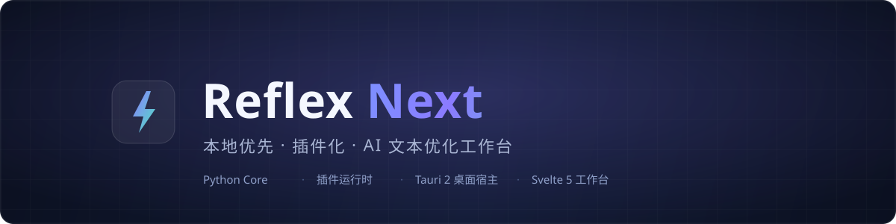
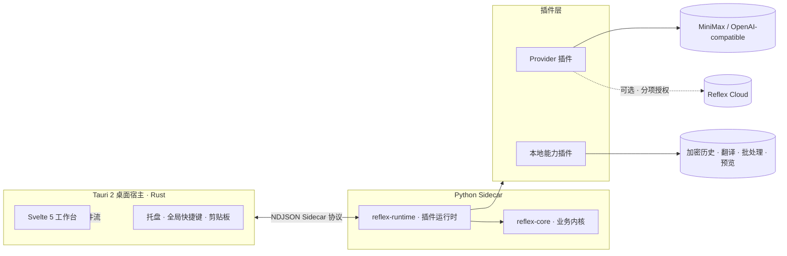

<div align="center">



# Reflex Next

**本地优先、插件化的 AI 文本优化工作台**

把「输入一段粗糙文字 → 得到结构化、可直接使用的结果」做成一条可靠的桌面主链：
场景自动识别、流式生成、可取消可重试，全部能力插件化，密钥永不上云。

[](https://github.com/DOIT-Ben/Reflex-Next/releases)
[](https://github.com/DOIT-Ben/Reflex-Next/actions/workflows/backend-ci.yml)
[](LICENSE)
[](https://github.com/DOIT-Ben/Reflex-Next/releases)
[](https://www.python.org/)
[](https://tauri.app/)
[](https://svelte.dev/)

[下载安装](#-快速开始) · [架构设计](#-架构) · [插件矩阵](#-插件矩阵) · [隐私与安全](#-隐私与安全) · [路线图](#-路线图) · [参与贡献](#-参与贡献)

**简体中文** · English（路线图中）

</div>

## 为什么做 Reflex Next

把文本丢给大模型很容易，**稳定地产出可用结果**很难：

- 每次都要重新解释背景、格式和要求，好用的提示词散落在聊天记录里；
- 流式输出中断、超时、限流没有统一处理，失败后只能整个重来；
- 提示词、原文、结果和截图混在一起发给云端，隐私边界说不清楚。

Reflex Next 把这些沉淀为一条**桌面级工作台主链**：场景自动路由、模板与变量、
流式输出与主动取消、稳定错误分类与重试、历史可追溯、密钥只留在本机。
业务内核不绑定任何 UI 框架和厂商——换 Provider、加插件、换界面，内核不动。

## ✨ 特性一览

**🔤 优化主链**

- 内容优化与结构化提示词生成两种模式，四种风格，多场景自动识别（可选本地语义识别增强）；
- 流式输出、主动取消、超时看护、有限重试和稳定错误分类，失败可一键重试；
- 结果可复制、可对比原文、可导出 Markdown，支持生成后自动替换剪贴板。

**🧩 插件化架构**

- Provider、历史、翻译、批处理、Markdown 预览、语义识别全部是插件；
- `reflex-core` 业务内核不依赖 PyQt、Tauri、SQLite 与任何模型库，可独立嵌入；
- 统一的插件运行时：发现、配置、并发上限、取消传播与 Sidecar 协议。

**🖥 桌面集成**

- Tauri 2 轻量宿主：托盘、全局快捷键、剪贴板读写、多窗口（工作台 + 历史）；
- 快捷面板：`Alt+Q` 随时唤起置顶小窗，自动带入剪贴板文字、`Ctrl+Enter` 直接优化、
  结果一键回写剪贴板，Esc 或失焦自动隐藏，配合开机自启静默常驻托盘；
- 视图缩放、多档窗口尺寸、命令面板（Ctrl+K）、键盘可达与焦点管理；
- Windows Credential Manager 保存 Provider 密钥，不落明文配置。

**☁️ 可选 Reflex Cloud**

- 匿名安装身份与免费额度，反馈、截图与改进计划按分项授权独立开关；
- 一键删除全部云端数据；未部署 Cloud 时，本地主链完整可用。

## 🏗 架构



架构边界是一条硬约束，由架构测试强制执行：

- `reflex-core` 禁止依赖 PyQt / Tauri / SQLite / 剪贴板 / torch；
- Provider 只做供应商协议适配，不决定场景、模板与产品模式；
- 历史加密存储在本机；Tauri Host 只消费事件流，不承载业务内核；
- 密钥、错误、日志与反馈数据在出口处统一脱敏。

## 🚀 快速开始

### 安装桌面版

前往 [**Releases**](https://github.com/DOIT-Ben/Reflex-Next/releases) 下载 Windows 安装包。
Alpha 阶段安装包未做代码签名，首次运行可能触发 SmartScreen 提示；
发布物随附 `SHA256SUMS.txt`，建议安装前校验。

### 从源码构建

```powershell
# 前置：Windows 10/11 · Python 3.12 + uv · Node.js 22 · Rust stable
git clone https://github.com/DOIT-Ben/Reflex-Next.git
cd Reflex-Next\apps\tauri-host
npm ci
npm run package:windows   # 构建 Python sidecar 并打包安装程序
```

### 本地开发

```powershell
# 仓库根目录：后端统一验证门禁（类型检查、单测、契约测试）
powershell -NoProfile -ExecutionPolicy Bypass -File tools\verify_backend.ps1 -SkipHeavy

# 桌面开发环境（前端热更新 + Rust Host）
cd apps\tauri-host
npm run tauri:dev
```

首次启动会引导选择 Provider：使用 Reflex Cloud 免费额度，或在设置中
填入自己的 MiniMax / OpenAI-compatible API Key（仅存于本机凭据管理器）。

## 🧩 插件矩阵

| 插件 | 职责 | 说明 |
|---|---|---|
| `provider-minimax` | MiniMax Provider | 流式、取消与稳定错误分类 |
| `provider-openai-compatible` | OpenAI-compatible Provider | 自定义 Base URL 与模型发现 |
| `provider-native-protocols` | 原生协议适配 | 新协议接入参考实现 |
| `provider-openai-responses` | Responses API Provider | OpenAI Responses 协议 |
| `history-sqlite` | 本地加密历史 | 可追溯、可评分、可复用 |
| `translator` | 翻译 | 插件路径与 Cloud 路径双通道 |
| `batch-runner` | 批处理 | 并发池、导入导出、逐条容错 |
| `markdown-preview` | Markdown 预览 | 结果即时渲染 |
| `semantic-detector` | 本地语义识别（可选） | 懒加载，模型缺失不阻塞主链 |

## 🔒 隐私与安全

- **密钥不出本机**：客户端自备的 Provider 密钥保存在 Windows Credential Manager，
  不写入仓库、配置文件、日志与诊断包，更不上传到 Reflex Cloud；
- **分项授权**：反馈、截图、改进计划各自独立开关，默认关闭，可随时撤回并一键删除云端数据；
- **出口脱敏**：Provider 错误、日志、诊断与反馈数据统一脱敏，发布物经密钥扫描门禁；
- **构建干净**：Release 构建移除开发用 Mock Provider；
- 安全问题请通过 [SECURITY.md](SECURITY.md) 的私密渠道报告。

## 🗺 路线图

- [x] 桌面主链：流式生成、取消、重试、历史、模板、多插件
- [x] Reflex Cloud 闭环：匿名身份、免费额度、反馈、质量发布与回滚
- [x] 全链路验证门禁：单测、契约测试、长稳测试（soak）工具、SBOM 与发布物扫描
- [ ] 正式 72 小时稳定性测试（soak）门禁（10,000 次请求/取消）
- [ ] 真实旧版本升级全链路验证
- [ ] 代码签名与自动更新
- [ ] 英文文档与更多 Provider 插件

> 当前处于 **公开 Alpha** 阶段，适合尝鲜与共同打磨，尚不建议作为生产依赖。
> 版本变更见 [更新日志](CHANGELOG.md)，后续计划见上方路线图。

## 📖 文档

| 文档 | 内容 |
|---|---|
| [统一文档导航](docs/INDEX.md) | 全部文档入口 |
| [架构设计](docs/ARCHITECTURE.md) | 分层、边界与数据流 |
| [隐私说明](docs/PRIVACY.md) | 数据收集与授权边界 |
| [故障处理](docs/TROUBLESHOOTING.md) | 常见问题与恢复 |
| [Cloud 部署](docs/CLOUD-BETA-RELEASE.md) | 自部署 Reflex Cloud |
| [更新日志](CHANGELOG.md) | 版本变更记录 |

## 🤝 参与贡献

欢迎 Issue 与 PR！提交前请阅读 [贡献指南](CONTRIBUTING.md)——
尤其是架构红线：Core 的依赖禁区、插件化边界与脱敏要求。
安全问题请勿公开 Issue，见 [安全策略](SECURITY.md)。

如果这个项目对你有帮助，欢迎点一个 Star ⭐ 收藏并接收 Release 通知。

## ⚖️ 许可证

[MIT](LICENSE) © HuangBen0209

<div align="center">
<a href="#为什么做-reflex-next">回到顶部</a>
</div>
